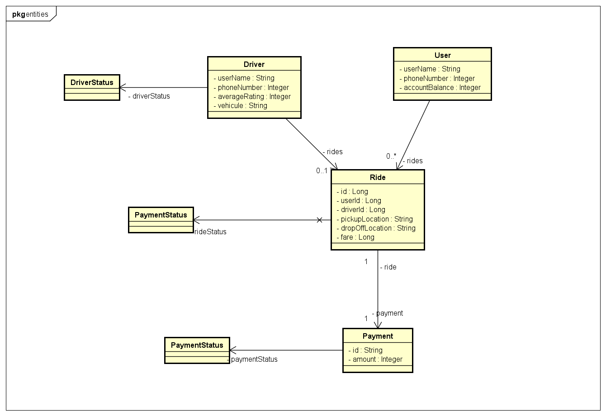

# AYGO-LAB02

Diseñar una Arquitectura de Microservicios para una Plataforma de Transporte (e.g., Uber)

## Descripción de la Tarea

1. **Analizar el Problema**: Identificar y modelar los recursos clave, tales como viajes, conductores, usuarios y pagos. Utilizar diagramas de clases o código para ilustrar los objetos del dominio.

2. **Identificar Recursos Relacionados y Métodos**: Determinar los recursos relacionados, incluyendo solicitudes de viaje, gestión de conductores y seguimiento en tiempo real.

3. **Definir la Representación de Recursos**: Estandarizar las interacciones entre servicios definiendo la representación de los recursos.

4. **Crear URIs de Modelos**: Establecer puntos de acceso claros y organizados desarrollando URIs concisas y consistentes para cada recurso.

5. **Asignar Métodos HTTP**: Asignar métodos HTTP a cada recurso basándose en los principios de diseño RESTful, tales como usar GET para detalles de viajes, POST para nuevas solicitudes de viaje y PUT para actualizar el estado del conductor.

6. **Diseñar una Arquitectura Escalable**: Diseñar una arquitectura de microservicios que garantice escalabilidad, comunicación en tiempo real y desarrollo modular.

7. **Implementar un Prototipo**: Crear un prototipo simple utilizando servicios en la nube, incluyendo **API Gateway**, **funciones Lambda** y **EC2**.

## Pasos de Desarrollo

1. **Identificar los Recursos – Modelado de Objetos**: Crear modelos para los objetos clave, tales como viajes, usuarios, conductores y pagos, utilizando diagramas de clases o estructuras de código.

2. **Crear URIs de Modelos**: Desarrollar URIs concisas y consistentes que representen cada recurso, garantizando agrupación lógica y simplicidad.

3. **Definir Representaciones de Recursos**: Definir cómo se representarán los recursos, por ejemplo, utilizando **JSON** en las respuestas de la API para asegurar la estandarización y facilidad de uso.

4. **Asignar Métodos HTTP**: Asignar los métodos HTTP adecuados (e.g., **GET** para recuperar detalles del viaje, **POST** para crear nuevas solicitudes de viaje, **PUT** para actualizar el estado del conductor) a las operaciones correspondientes para cada recurso.

## Diagrama de clases 

A continuacion se presenta los objetos del dominio

