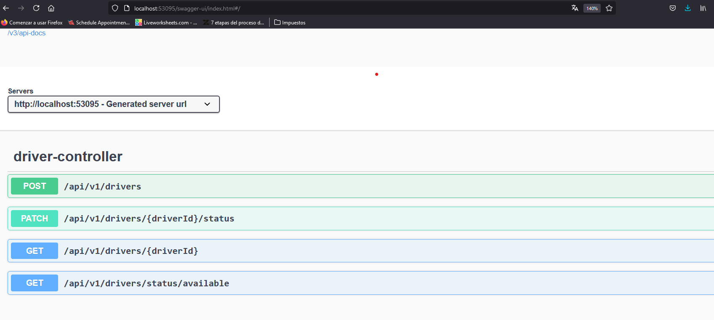

# Ride Service

>[!IMPORTANT]
Para que el proyecto se inicie correctamente sin ninguna excepción, es necesario iniciar primero el servicio de discovery. Esto permite que los diferentes servicios sepan a qué URL hacer las solicitudes. En caso de que no esté en ejecución, consulta el siguiente [manual](../discovery-service/README.md)

## Compilar el Proyecto con Maven

En el directorio raíz del proyecto, ejecuta el siguiente comando

```bash
mvn clean install
```

###  Comandos para ejecutar la aplicacion

Para ejecutar el proyecto y establecer la variable de entorno URL_EUREKA_SERVER, usa el siguiente comando:

### Windows


```bash
URL_EUREKA_SERVER=http://localhost:8761/eureka java -cp "target/classes;target/dependency/*" com.uber.clone.DriverServiceApplication
```

### Linux

```bash
URL_EUREKA_SERVER=http://localhost:8761/eureka java -cp "target/classes:target/dependency/*" com.uber.clone.DriverServiceApplication
```

## Uris de driver service

Para explicar los respectivos uris de este recurso nos podemos apoyar de swagger-ui, para poder acceder a este bastara con colocar

```bash
http://localhost:<port>/swagger-ui/index.html
```


si todo sale bien veremos lo siguiente 





## Representacion del recurso

representacion de un conductor

```json
{
  "id": 1,
  "registeredDate": "2024-11-10T03:11:47.226Z",
  "phoneNumber": 3142135901,
  "averageRating": 5,
  "vehicule": "camaro",
  "driverStatus": "AVAILABLE"
}
```