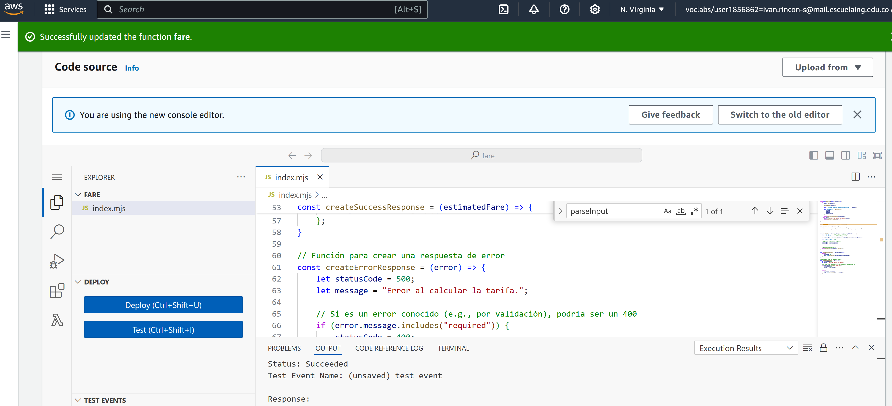
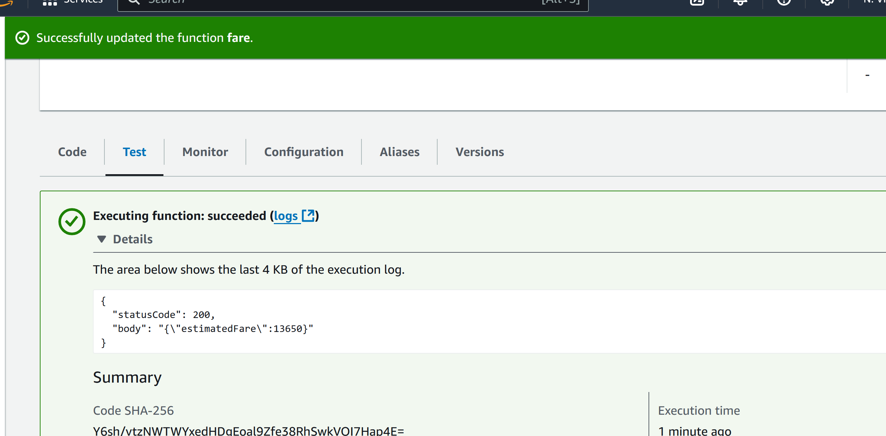
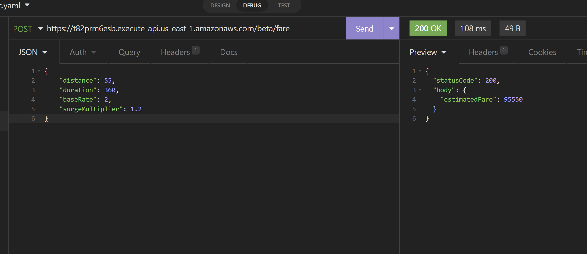

# Funcion Lambda

En nuestro caso implementamos una funcion lambda, encargada de realizar la consulta de la tarifa del viaje dado informacion relevante del viaje como:

- distancia
- duracion estimada del viaje
- tarifa base (puede ser en cualquier moneda, por ejemplo, dólares o pesos).
- multiplicador de la tarifa


## Representacion del recurso

la representacion de dicha informacion sera representada en un formato json, como el siguiente:

```json
{
    "distance": 10,
    "duration": 15,
    "baseRate": 5,
    "surgeMultiplier": 1.2
}
```
## URI del recurso 


Una vez definida la estructura de nuestro objeto, procederemos a crear la función Lambda encargada de leer, procesar y entregar una respuesta de la tarifa del viaje. Para esto, nos apoyaremos en la [siguiente función](fare-lambda-function.js).


Ahora procederemos a configurarla y desplegarla en AWS, como se aprecia en la siguiente imagen.



Una vez configurada nuestra funcion lambda, podemos realizar una simulacion probando la misma, como se aprecia en la siguiente imagen



Por ultimo desplegaremos e integraremos con gateway de AWS, la funcion lambda y realizaremos una prueba de su funcionamiento, para estp podremos realizarlo de dos maneras


1. utilizando cualquier plataforma que soporte consumo de APIS, como en el siguiente ejemplo


2. realizar la siguiente consulta por medio de cmd

```cmd
curl -X POST https://t82prm6esb.execute-api.us-east-1.amazonaws.com/beta/fare \
-H "Content-Type: application/json" \
-d '{
    "distance": 10,
    "duration": 15,
    "baseRate": 5,
    "surgeMultiplier": 1.2
}'
```

donde deberiamos recibir una respuesta del siguiente formato

```json
{
	"statusCode": 200,
	"body": {
		"estimatedFare": 95550
	}
}
```